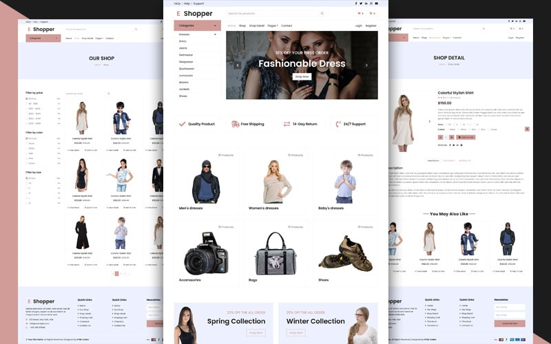

# e-shopper Ecommerce Apparel Shop
 Welcome to the Ecommerce Apparel Shop repository! 
 This project is an online store that allows users to browse different categories of clothing and shoes. 
 It features a cart functionality but currently does not include login, logout, or transaction functionalities.
 ()

 # Demo
Check out the live demo of the e-shopper Ecommerce Apparel Shop website: [Live Demo Link](https://hadiqaaziz.github.io/e-shopper-Ecommerce-Apparel-Shop/)

# Table of Contents
Features
Pages
Installation
Usage
Project Structure
Technologies Used
Future Enhancements
Contributing
License
# Features
- Browse different categories of clothing (e.g., Dresses, Jackets, Shoes)
- View details of each product
- Add products to the cart
- View and update the cart
- Checkout page (without transaction functionality)
- Contact page for customer inquiries
# Pages
- index.html: The main landing page of the shop.
- shop.html: The page listing various products available for sale.
- detail.html: The product detail page where users can see more information about a product.
- cart.html: The cart page where users can view and update their cart.
- checkout.html: The checkout page where users can review their order before finalizing (note: transaction functionality not implemented).
- contact.html: The contact page where users can send inquiries or feedback.
# Installation
Clone the repository:
git clone https://github.com/yourusername/ecommerce-apparel-shop.git

Navigate to the project directory:
cd ecommerce-apparel-shop

# Usage
- Open index.html in your web browser to view the main page of the shop.
- Browse the different categories of clothing and shoes on the shop.html page.
- Click on a product to view its details on the detail.html page.
- Add desired products to your cart.
- View the cart by navigating to the cart.html page.
- Proceed to checkout on the checkout.html page.
- Contact us through the contact.html page for any inquiries.

# Technologies Used
- HTML
- CSS
- JavaScript
- Bootstrap
  
# Future Enhancements
Add login and logout functionality
Implement transaction functionality on the checkout page
Improve user interface and user experience
Add product reviews and ratings
Implement search functionality
Enhance cart functionality with discount codes and promotions

# Contributing
Contributions are welcome! 

# License
This project is licensed under the MIT License. See the LICENSE file for details.
